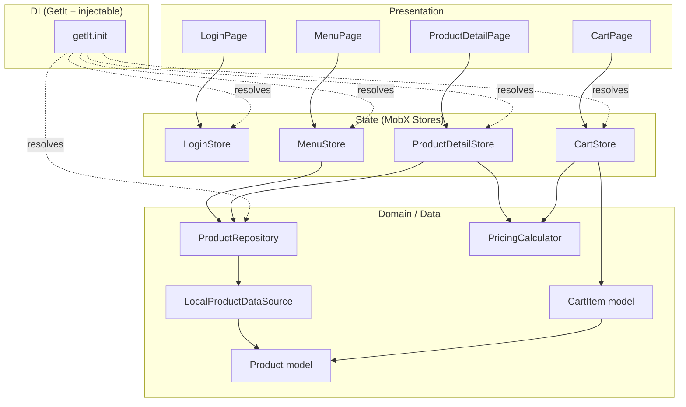
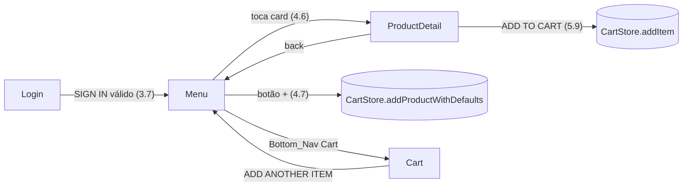
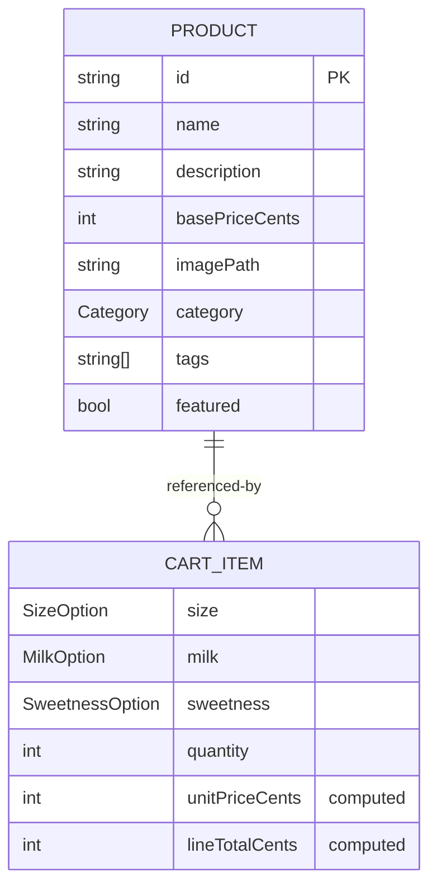

# Design Document

## Overview

Esta feature transforma o projeto Flutter existente `coffe_plus` no aplicativo de cafeteria artesanal "The Sensory Pour". O design cobre duas dimensões complementares:

1. **Arquitetura de aplicação** — MobX para gerência de estado reativa, GetIt + injectable para injeção de dependências, json_serializable para modelos de dados, e build_runner para geração de código. Tudo organizado sob a estrutura por features já adotada (`lib/features/{feature}`).
2. **Camada de apresentação** — quatro telas (Login, Menu/Explorar Sabores, Detalhes do Produto e Carrinho), um tema unificado marrom/creme com tipografia serifada, um catálogo de produtos mockado localmente, e o reaproveitamento das imagens presentes em `assets/images/`.

O escopo é cliente/front-end. Autenticação social (Google/Apple), checkout de pagamento e persistência remota são representados na UI mas implementados como stubs/mocks locais.

### Pesquisa e decisões de tecnologia

As versões abaixo foram escolhidas por compatibilidade com o SDK Dart `^3.12.2` (Flutter 3.x) declarado em `pubspec.yaml`. Estas são as bibliotecas canônicas do ecossistema Flutter para os papéis solicitados:

- **mobx / flutter_mobx** — solução de estado reativa baseada em observables, actions e computeds. `flutter_mobx` fornece o widget `Observer` que reconstrói apenas o subtree afetado. Referência: [MobX for Dart](https://mobx.netlify.app/).
- **get_it / injectable** — `get_it` é um service locator; `injectable` gera o código de registro a partir de anotações (`@injectable`, `@singleton`, `@lazySingleton`), eliminando o registro manual. Referência: [injectable no pub.dev](https://pub.dev/packages/injectable).
- **json_serializable / json_annotation** — geram `fromJson`/`toJson` a partir de anotações `@JsonSerializable`, garantindo serialização confiável. Referência: [json_serializable no pub.dev](https://pub.dev/packages/json_serializable).
- **build_runner** — orquestrador de geração de código que executa `mobx_codegen`, `injectable_generator` e `json_serializable`.

Conteúdo consultado foi resumido e parafraseado a partir da documentação oficial dos pacotes. Content was rephrased for compliance with licensing restrictions.

Decisão-chave: **precificação em centavos inteiros**. Todos os cálculos monetários (preço base, acréscimos, line total, subtotal, tax, total) são feitos em `int` representando centavos, evitando erros de arredondamento de ponto flutuante. A conversão para exibição (`$5.50`) ocorre apenas na camada de formatação. Isto torna os cálculos determinísticos e testáveis por propriedades.

## Architecture

### Estilo arquitetural

O app segue uma arquitetura em camadas por feature, com fluxo de dados unidirecional via MobX:

- **Presentation (Pages/Widgets)** — widgets Flutter que observam Stores via `Observer` e disparam `@action`s.
- **State (Stores MobX)** — estado observável e lógica de interação de cada tela.
- **Domain/Data (Models + Repository)** — modelos serializáveis e um repositório que fornece o catálogo mockado.
- **DI (injectable + GetIt)** — resolve Stores e Repositories.



### Estrutura de pastas

```
lib/
├── main.dart                         # bootstrap: configureDependencies() + MaterialApp
├── di/
│   ├── injection.dart                # @InjectableInit configureDependencies()
│   └── injection.config.dart         # gerado (getIt.init())
├── core/
│   ├── theme/
│   │   └── app_theme.dart            # tema "The Sensory Pour"
│   ├── pricing/
│   │   └── pricing_calculator.dart   # cálculos puros de preço (centavos)
│   └── routing/
│       └── app_routes.dart           # nomes e navegação entre telas
├── features/
│   ├── catalog/                      # domínio compartilhado de produtos
│   │   ├── models/
│   │   │   ├── product.dart          # + product.g.dart (gerado)
│   │   │   ├── category.dart         # enum Category
│   │   │   └── options.dart          # SizeOption, MilkOption, SweetnessOption
│   │   └── data/
│   │       ├── product_repository.dart
│   │       └── local_product_data_source.dart   # catálogo mockado + mapa de imagens
│   ├── login/
│   │   ├── pages/login_page.dart     # já existe (será refatorada)
│   │   ├── stores/login_store.dart   # + login_store.g.dart
│   │   └── widgets/
│   ├── menu/
│   │   ├── pages/menu_page.dart
│   │   ├── stores/menu_store.dart    # + menu_store.g.dart
│   │   └── widgets/product_card.dart
│   ├── product_detail/
│   │   ├── pages/product_detail_page.dart
│   │   ├── stores/product_detail_store.dart   # + .g.dart
│   │   └── widgets/
│   └── cart/
│       ├── models/cart_item.dart     # + cart_item.g.dart
│       ├── pages/cart_page.dart
│       ├── stores/cart_store.dart    # + cart_store.g.dart
│       └── widgets/cart_line.dart
```

### Bootstrap e injeção de dependências

O `main` chama `configureDependencies()` antes de renderizar a UI. A função é gerada por injectable:

```dart
// lib/di/injection.dart
import 'package:get_it/get_it.dart';
import 'package:injectable/injectable.dart';
import 'injection.config.dart';

final GetIt getIt = GetIt.instance;

@InjectableInit()
void configureDependencies() => getIt.init();
```

```dart
// lib/main.dart (refatorado)
void main() {
  configureDependencies();       // registra tudo antes da UI (Req 1.4)
  runApp(const MyApp());
}
```

**Escopos de registro:**
- `ProductRepository` / `LocalProductDataSource` → `@lazySingleton` (estado do catálogo é global e imutável).
- `CartStore` → `@lazySingleton` (o carrinho é compartilhado entre Menu, Detalhes e Carrinho).
- `LoginStore`, `MenuStore` → `@injectable` (factory; nova instância por tela).
- `ProductDetailStore` → `@injectable`, recebendo o `Product` selecionado como parâmetro de runtime (`@factoryParam`).

### Padrão das Stores MobX

Cada Store segue o padrão canônico mobx_codegen com `part` do arquivo gerado:

```dart
// lib/features/login/stores/login_store.dart
import 'package:injectable/injectable.dart';
import 'package:mobx/mobx.dart';

part 'login_store.g.dart';

@injectable
class LoginStore = LoginStoreBase with _$LoginStore;

abstract class LoginStoreBase with Store {
  @observable
  String email = '';

  @observable
  String password = '';

  @observable
  bool obscurePassword = true;

  @observable
  bool rememberMe = false;

  @computed
  bool get isEmailValid => _emailRegex.hasMatch(email.trim());

  @computed
  bool get isPasswordValid => password.isNotEmpty;

  @computed
  bool get canSubmit => isEmailValid && isPasswordValid;

  @action
  void togglePasswordVisibility() => obscurePassword = !obscurePassword;

  @action
  void toggleRememberMe() => rememberMe = !rememberMe;
}
```

Regras aplicadas a todas as Stores:
- `part '<nome>_store.g.dart';` no topo.
- Mixin de duas partes: `class X = XBase with _$X;` e `abstract class XBase with Store`.
- Estado mutável em `@observable`, derivações em `@computed`, mutações em `@action`.
- Widgets envolvem trechos reativos em `Observer(builder: ...)`.

## Components and Interfaces

### PricingCalculator (função pura, `lib/core/pricing/`)

Núcleo testável por propriedades. Opera em centavos (`int`). Não tem dependências nem estado.

```dart
class PricingCalculator {
  /// Preço unitário = preço base do produto + acréscimo do leite (em centavos).
  static int unitPriceCents({
    required int basePriceCents,
    required int milkSurchargeCents,
  }) => basePriceCents + milkSurchargeCents;

  /// Line total = preço unitário × quantidade.
  static int lineTotalCents({required int unitPriceCents, required int quantity})
      => unitPriceCents * quantity;

  /// Subtotal = soma dos line totals.
  static int subtotalCents(Iterable<int> lineTotals)
      => lineTotals.fold(0, (a, b) => a + b);

  /// Tax = arredondamento do subtotal × taxRate (ex.: 0.08 → 8%).
  static int taxCents(int subtotalCents, double taxRate)
      => (subtotalCents * taxRate).round();

  /// Total = subtotal + tax − desconto, com piso em 0.
  static int totalCents({
    required int subtotalCents,
    required int taxCents,
    required int discountCents,
  }) {
    final t = subtotalCents + taxCents - discountCents;
    return t < 0 ? 0 : t;
  }
}
```

### ProductRepository / LocalProductDataSource

```dart
abstract class ProductRepository {
  List<Product> getAll();
  List<Product> getByCategory(Category category);
  Product getById(String id);
}

@LazySingleton(as: ProductRepository)
class LocalProductRepository implements ProductRepository {
  final LocalProductDataSource _dataSource;
  LocalProductRepository(this._dataSource);
  // getByCategory filtra getAll() pela categoria
}
```

`LocalProductDataSource` fornece o catálogo mockado fixo (ver Data Models) e o mapeamento de imagens.

### Stores — interfaces públicas resumidas

| Store | Observables | Computeds | Actions |
|-------|-------------|-----------|---------|
| LoginStore | email, password, obscurePassword, rememberMe | isEmailValid, isPasswordValid, canSubmit | setEmail, setPassword, togglePasswordVisibility, toggleRememberMe |
| MenuStore | selectedCategory | filteredProducts | selectCategory(Category) |
| ProductDetailStore | product, size, milk, sweetness, quantity | unitPriceCents, totalPriceCents | selectSize, selectMilk, selectSweetness, increment, decrement, buildCartItem |
| CartStore | items (ObservableList\<CartItem\>), promoCode, appliedDiscountCents, promoError | subtotalCents, taxCents, totalCents, isEmpty | addItem, addProductWithDefaults, updateQuantity, removeItem, applyPromo |

### Navegação

Navegação por rotas nomeadas em `app_routes.dart`:



Rotas: `/login`, `/menu`, `/product-detail` (recebe `Product` como argumento), `/cart`.

## Data Models

### Category (enum)

```dart
enum Category { espresso, brewed, coldBrew }
```

### Options

```dart
enum SizeOption { oz8, oz12, oz16 }

enum MilkOption {
  whole(surchargeCents: 0),
  oat(surchargeCents: 75),
  almond(surchargeCents: 75);
  const MilkOption({required this.surchargeCents});
  final int surchargeCents;
}

enum SweetnessOption { none, light, regular }
```

### Product

```dart
@JsonSerializable()
class Product {
  final String id;
  final String name;
  final String description;
  final int basePriceCents;      // ex.: 550 => $5.50
  final String imagePath;        // caminho em assets/images/
  final Category category;
  final List<String> tags;
  final bool featured;

  const Product({
    required this.id,
    required this.name,
    required this.description,
    required this.basePriceCents,
    required this.imagePath,
    required this.category,
    this.tags = const [],
    this.featured = false,
  });

  factory Product.fromJson(Map<String, dynamic> json) => _$ProductFromJson(json);
  Map<String, dynamic> toJson() => _$ProductToJson(this);
}
```

Campos obrigatórios (`id`, `name`, `description`, `basePriceCents`, `imagePath`, `category`) sem valor default fazem `_$ProductFromJson` lançar em JSON incompleto (Req 2.5).

### CartItem

```dart
@JsonSerializable(explicitToJson: true)
class CartItem {
  final Product product;
  final SizeOption size;
  final MilkOption milk;
  final SweetnessOption sweetness;
  final int quantity;             // >= 1

  const CartItem({
    required this.product,
    required this.size,
    required this.milk,
    required this.sweetness,
    required this.quantity,
  });

  int get unitPriceCents => PricingCalculator.unitPriceCents(
        basePriceCents: product.basePriceCents,
        milkSurchargeCents: milk.surchargeCents,
      );

  int get lineTotalCents => PricingCalculator.lineTotalCents(
        unitPriceCents: unitPriceCents, quantity: quantity,
      );

  CartItem copyWith({int? quantity}) => CartItem(
        product: product, size: size, milk: milk,
        sweetness: sweetness, quantity: quantity ?? this.quantity,
      );

  factory CartItem.fromJson(Map<String, dynamic> json) => _$CartItemFromJson(json);
  Map<String, dynamic> toJson() => _$CartItemToJson(this);
}
```

### Catálogo mockado (Req 4.9)

| id | name | basePriceCents | category | featured | imagePath |
|----|------|----------------|----------|----------|-----------|
| p1 | Signature Lavender Latte | 550 | espresso | true | assets/images/coffe.jpeg |
| p2 | Double Espresso | 350 | espresso | false | assets/images/coffe_only.jpeg |
| p3 | Iced Americano | 400 | coldBrew | false | assets/images/coffe_3.jpeg |
| p4 | Butter Croissant | 450 | brewed | false | assets/images/croassant.jpeg |
| p5 | Pour Over V60 | 500 | brewed | false | assets/images/coffe_one.jpeg |

### Mapeamento e fallback de imagens (Req 7)

O `LocalProductDataSource` define um mapa `id -> imagePath` usando apenas arquivos existentes. Imagens auxiliares por tela:

- Fundo de login: `assets/images/background_login.jpeg`
- Detalhes/hero de produto: `assets/images/coffe_details.jpeg`
- Ícones/decorativos: `email.jpeg`, `eye.jpeg`, `home.jpeg`, `login.jpeg`, `order_details.jpeg`, `download.jpeg`, `soda.jpeg`, `croassant_two.jpeg`
- **Fallback padrão** (Req 7.3): quando `imagePath` de um Product não resolve, usa `assets/images/coffe.jpeg`.



## Correctness Properties

*A property is a characteristic or behavior that should hold true across all valid executions of a system — essentially, a formal statement about what the system should do. Properties serve as the bridge between human-readable specifications and machine-verifiable correctness guarantees.*

As propriedades abaixo derivam do prework de análise das acceptance criteria. Elas focam na lógica pura e determinística do app (validação, precificação, filtragem, serialização, resolução de imagem) — que é onde a variação de entrada revela bugs. Critérios puramente de renderização de UI e de navegação são cobertos por widget tests (ver Testing Strategy), não por propriedades.

### Property 1: Product serialization round-trip

*For any* Product válido, desserializar o resultado de sua serialização JSON produz um Product igual ao original: `Product.fromJson(p.toJson()) == p`.

**Validates: Requirements 2.3**

### Property 2: CartItem serialization round-trip

*For any* CartItem válido (com Product aninhado, opções e quantidade >= 1), desserializar o resultado de sua serialização JSON produz um CartItem igual ao original: `CartItem.fromJson(c.toJson()) == c`.

**Validates: Requirements 2.4**

### Property 3: Missing required fields fail deserialization

*For any* Product válido, remover qualquer um de seus campos obrigatórios do JSON faz `Product.fromJson` lançar um erro de desserialização.

**Validates: Requirements 2.5**

### Property 4: Toggle parity

*For any* estado booleano inicial (visibilidade de senha ou "remember me") e *for any* número de toggles aplicados, o estado final é igual ao inicial quando o número de toggles é par, e é o oposto quando é ímpar.

**Validates: Requirements 3.3, 3.4**

### Property 5: Email validity classification

*For any* string de email, `isEmailValid` é verdadeiro se e somente se a string (após trim) corresponde ao formato de email; strings sem `@` ou sem domínio são classificadas como inválidas.

**Validates: Requirements 3.5, 3.6**

### Property 6: Unit price includes milk surcharge

*For any* preço base (em centavos) e *for any* Milk_Option, o preço unitário calculado é igual ao preço base somado ao acréscimo daquela opção de leite: `unitPriceCents == basePriceCents + milk.surchargeCents`.

**Validates: Requirements 5.5**

### Property 7: Quantity floor invariant

*For any* sequência de operações de incremento e decremento a partir da quantidade inicial 1, a quantidade permanece sempre >= 1 e é igual a `max(1, 1 + (nº de incrementos − nº de decrementos aplicados acima do piso))`.

**Validates: Requirements 5.6, 5.7**

### Property 8: Line total equals unit price times quantity

*For any* preço unitário e *for any* quantidade >= 1, o total exibido no botão ADD TO CART é igual a `unitPriceCents × quantity`.

**Validates: Requirements 5.8**

### Property 9: Added cart item preserves selections

*For any* combinação de Product, Size_Option, Milk_Option, Sweetness_Option e quantidade selecionados, o CartItem adicionado ao Carrinho possui exatamente esses valores em seus campos.

**Validates: Requirements 4.7, 5.9**

### Property 10: Subtotal is the sum of line totals

*For any* lista de Cart_Item no Carrinho (incluindo após alterações de quantidade ou remoções), o Subtotal é igual à soma dos Line_Total de todos os itens presentes.

**Validates: Requirements 6.2, 6.3, 6.4**

### Property 11: Total clamps at zero after discount

*For any* Subtotal, Tax e desconto de Promo_Code, o Total é igual a `max(0, subtotal + tax − desconto)`, nunca ficando negativo.

**Validates: Requirements 6.6**

### Property 12: Checkout availability mirrors cart emptiness

*For any* estado do Carrinho, o botão PROCEED TO CHECKOUT está habilitado se e somente se o Carrinho contém ao menos um Cart_Item.

**Validates: Requirements 6.8**

### Property 13: Category filter soundness and completeness

*For any* catálogo de produtos e *for any* Category selecionada, a lista filtrada contém exatamente os produtos cuja categoria é a selecionada — nenhum de outra categoria, e nenhum da categoria selecionada omitido.

**Validates: Requirements 4.5**

### Property 14: Featured badge reflects the flag

*For any* Product, o card correspondente exibe o badge "FEATURED" se e somente se `product.featured` é verdadeiro.

**Validates: Requirements 4.4**

### Property 15: Image resolution always yields an existing asset

*For any* Product (com imagem mapeada, ausente ou não mapeada), o caminho de imagem resolvido pertence ao conjunto de arquivos existentes em `assets/images/`; quando não há imagem específica, o resolver retorna a imagem padrão existente (`assets/images/coffe.jpeg`).

**Validates: Requirements 7.1, 7.3**

## Error Handling

- **Desserialização inválida (Req 2.5):** `Product.fromJson`/`CartItem.fromJson` (gerados por json_serializable) lançam `CheckedFromJsonException`/`TypeError` quando campos obrigatórios estão ausentes ou têm tipo incorreto. Chamadores que carregam dados externos devem envolver a chamada em try/catch e tratar como catálogo inválido.
- **Validação de login (Req 3.5, 3.6):** a validação é derivada por computeds (`isEmailValid`, `isPasswordValid`); a UI exibe mensagens de erro nos campos e desabilita/bloqueia o SIGN IN enquanto `canSubmit` for falso. Nenhuma exceção é lançada.
- **Promo code inválido (Req 6.7):** `CartStore.applyPromo` não lança; define `promoError` com mensagem e mantém `appliedDiscountCents` em 0. A UI observa `promoError` e exibe a mensagem.
- **Piso de quantidade (Req 5.7):** `decrement` é uma `@action` que aplica `quantity = max(1, quantity - 1)`, evitando estados inválidos em vez de lançar.
- **Total negativo (Req 6.6):** `PricingCalculator.totalCents` aplica piso em 0, prevenindo totais negativos quando o desconto excede subtotal + tax.
- **Imagem ausente (Req 7.3):** o resolver de imagem retorna o asset padrão em vez de falhar o carregamento; `Image.asset` nunca recebe um caminho inexistente.
- **DI não configurada:** resolver uma Store antes de `configureDependencies()` lança erro do GetIt; mitigado por chamar a configuração no início do `main` (Req 1.4).

## Testing Strategy

O feature combina lógica pura testável por propriedades com telas Flutter cuja verificação é de renderização/navegação. A estratégia é dupla e proporcional ao tipo de cada critério (conforme classificação do prework).

### Bibliotecas

- **Property-based testing:** [`glados`](https://pub.dev/packages/glados) — biblioteca de property-based testing para Dart, integrada ao `package:test`. Não implementaremos PBT do zero.
- **Widget/UI tests:** `flutter_test` (`testWidgets`, `WidgetTester`, `find`).
- **Store tests:** `package:test` + `package:mobx` (verificação direta de observables/actions/computeds).

### Testes baseados em propriedades

- Cada uma das 15 propriedades da seção Correctness Properties é implementada por **um único** teste property-based com glados.
- Cada teste roda no **mínimo 100 iterações** (configuração padrão do glados ajustada via `Glados(...).test`, garantindo `numRuns >= 100`).
- Geradores customizados:
  - `any.product` — gera `Product` com strings arbitrárias, `basePriceCents` em `[0, 100000]`, categoria/tags/featured aleatórios e `imagePath` do conjunto de assets existentes.
  - `any.cartItem` — combina `any.product` com opções aleatórias e `quantity` em `[1, 50]`.
  - `any.togglesSequence`, `any.incDecSequence` — listas de operações para propriedades 4 e 7.
  - `any.email` — mistura de emails válidos e strings inválidas para a propriedade 5.
- Cada teste é anotado com um comentário no formato:
  `// Feature: coffee-shop-app, Property {n}: {texto da propriedade}`
- Propriedades 14 e 15, embora envolvam a camada de apresentação, são testáveis sobre a **lógica de decisão** (função que decide exibir o badge; resolver de imagem) sem renderizar UI, mantendo-as adequadas a PBT.

### Testes de exemplo / widget (UI e navegação)

Critérios classificados como EXAMPLE (renderização e navegação) são cobertos por `testWidgets` com 1–3 exemplos cada:
- Login: presença de background + card, título serifado, campos, links e botões (3.1, 3.2, 3.8); navegação para Menu com credenciais válidas (3.7).
- Menu: app bar, filtros, cards com campos, bottom nav (4.1, 4.2, 4.3, 4.8); navegação ao tocar card (4.6); conteúdo do catálogo mockado e preços (4.9).
- Detalhes: hero/nome/preço/tags/desc, seletores e defaults (5.1–5.4).
- Carrinho: lista de itens, order summary, botões e bottom nav (6.1, 6.5, 6.9).

### Edge cases (unit tests)

Critérios EDGE_CASE recebem unit tests focados:
- Senha vazia/whitespace ⇒ `isPasswordValid` falso (3.6).
- Cada campo obrigatório ausente ⇒ `Product.fromJson` lança (reforça a Property 3 com exemplos concretos, 2.5).
- Promo code inválido ⇒ `promoError` definido, desconto 0 (6.7).

### Smoke / integração de wiring

Critérios SMOKE/INTEGRATION (configuração e DI):
- Após `configureDependencies()`, `getIt` resolve `LoginStore`, `MenuStore`, `ProductDetailStore`, `CartStore` e `ProductRepository` (1.4, 1.5).
- `pubspec.yaml` declara as dependências e o diretório de assets (1.1, 1.2, 1.3, 7.2) — verificado por checagem de projeto e por `flutter analyze` + `dart run build_runner build` no CI (1.6).

### Balanceamento

Poucos widget tests por tela (representativos), evitando duplicar o que as propriedades já cobrem em nível de lógica. As propriedades cobrem a variação ampla de entradas (precificação, filtragem, serialização); os widget tests confirmam que a UI reflete essa lógica.
